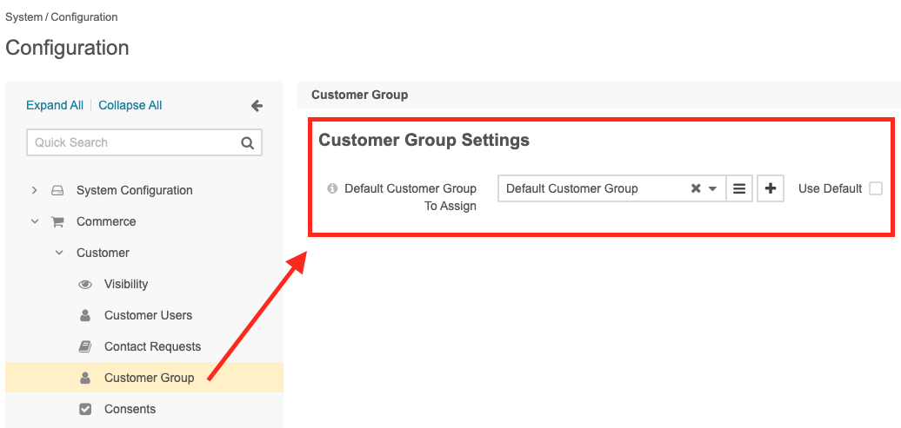

# Diglin\AutoCustomerGroupBundle

This OroCommerce bundle allows you to automatically assign a customer to a customer group when the customer is newly created and no customer group is already assign to him.

It can be interesting to use this feature for the following cases, for example:
- You setup OroCommerce for B2C and needs to assign a tax code to customers
- Your B2B customers needs to have specific Payment Terms automatically assigned by default

As those previous cases can be done by setting a customer group configuration, making that automatically can save to the merchant time and errors.

**NOTE**: tested and developed on Community edition. It will work also on the Enterprise version, however it has not been tested to know if it supports multiple websites or multiple organisations features. If you are interested for those cases, let us know and we will go through it.

## Installation

```
composer require diglin/orocommerce-auto-customergroup-assignment
bin/console --env=prod cache:clear
bin/console --env=prod oro:process:configuration:load
```

## Configuration

Go to the admin, then select the menu System > Configuration > Commerce > Customer Group.
Choose the customer group you want to assign a customer.



## Requirements

Message consumer of Oro messages must be correctly configured, meaning, it must run in background. `bin/console --env=prod oro:message-queue:consume`

And you may want to add an additional customer group different as the one for guest `Non-Authenticated Visitors`

## Usage

Create a new customer from backend or frontend, wait few seconds or minutes and refresh the customer view page in backend to see the change happens.

## Known issues

- None

## License

See [LICENSE.txt](./LICENSE.txt)

## Author

* Diglin GmbH
* https://www.diglin.com/
* [@diglin_](https://twitter.com/diglin_)
* [Follow us on github!](https://github.com/diglin)
